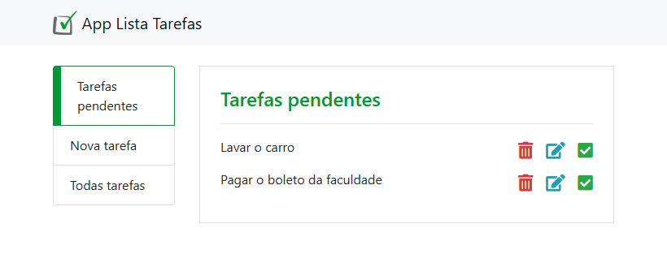
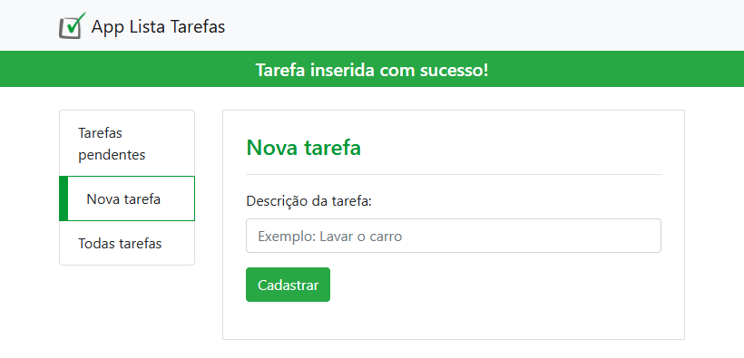
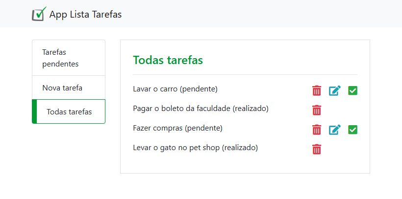

# App_Lista_Tarefas

Curso online:

Domine Web - 20 Cursos - HTML5, CSS3, SASS, Bootstrap, JS, ES6, PHP, MySQL, JQuery, MVC, APIs, IONIC e muito mais

Autores:
Jorge Sant Ana e Jamilton Damasceno

Construção de um site para controle de tarefas utilizando Bootstrap 4 e PHP com PDO. 

>Figura 1: Tarefas pendentes

 
>Figura 2: Cadastro de uma nova tarefa

>Figura 3: Lista de todas as tarefas

 
